# Pokemon Discord Bot

A Pokemon discord bot implemented in python. Contains pokemon minigames, a simple TCG, and anime commands. Uses PostgreSQL. 

## Features

### Pokemon 
- A pokemon trading card game where the objective is to collect them all! Features trading.
  
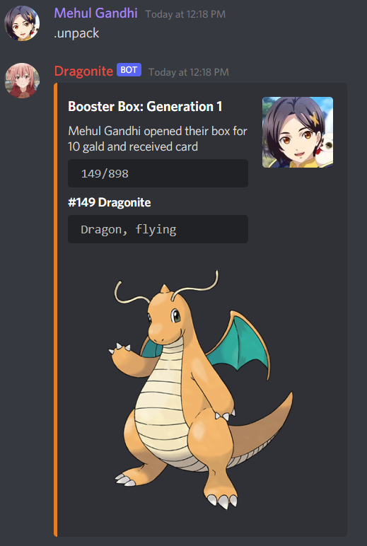
- Pokemon minigames such as hangman, a word scrambler game, a beta slot machine, and a guess the pokemon game.
- The assets for the pokemon guessing game are stored in the pokemon folder.
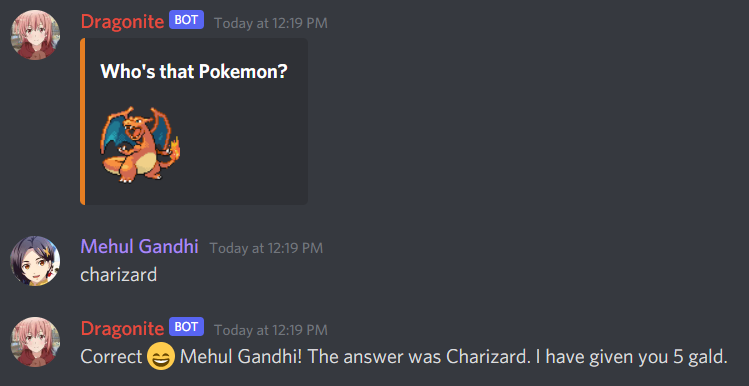
- Catch other discord members in a server (up to 3) and add them to your party! Features poke balls, great balls, ultra balls, and master balls.
- Has the following commands: party, catch, release, owner 
### Shop
- Buy items from AntLionMan's shop!
 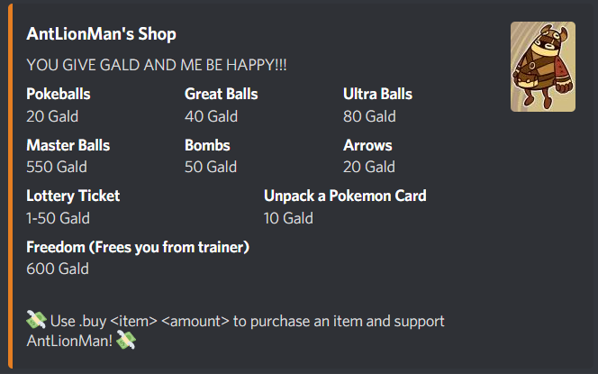
 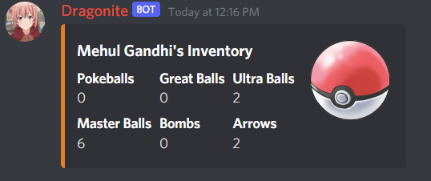
### Anime
- Search information about an anime in MAL.
- Kawaii related anime commands: hug, kiss, baka, slap, punch, pat. These commands send a random anime picture and allows users to interact with one another.
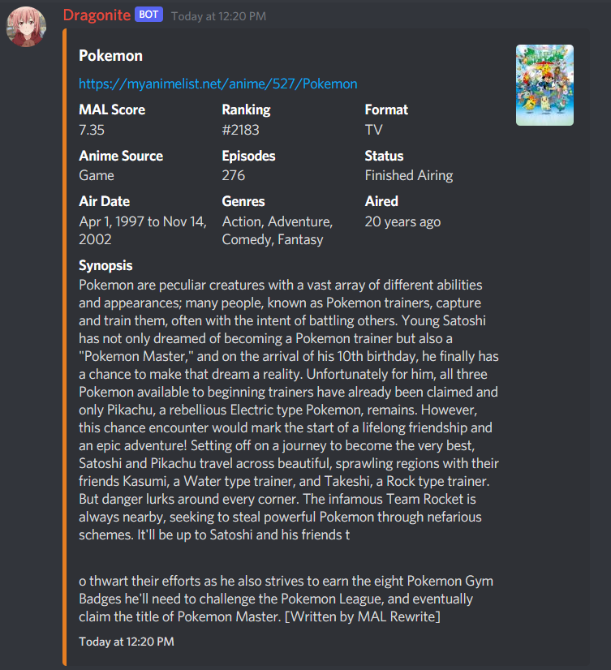
  
### Games
- TicTacToe with another player. Use ,ttt (mention other player)to start a game and ,place (row number) (column number) to make a move.
  If no player is mentioned to play against, the player plays against the bot, which uses the minimax algorithm to make a move.
- Blackjack, Poker (5 Card Draw). The assets for cards are stored in the cards folder and abyss folder.
- Rock, paper, scissors
- Lottery, flip a coin, 8ball
- Buy arrows or bombs.

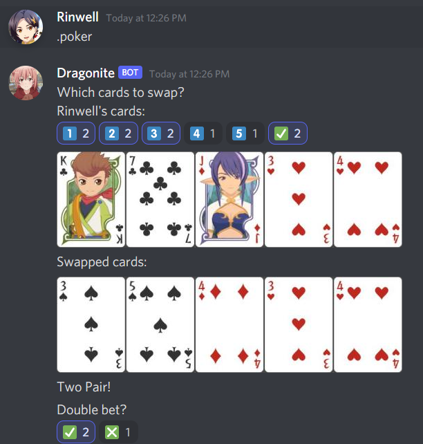
  
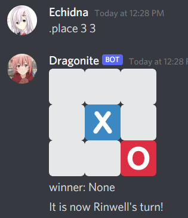

### Search
- Use the bot to search for a YouTube video.
  
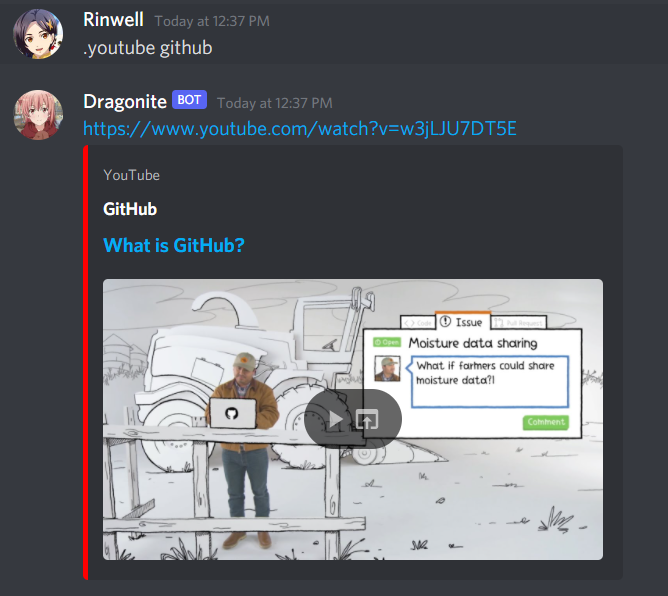
- Search the definition of a word using the ,word command.
- Search the definition of a word in the user defined dictionary.
  
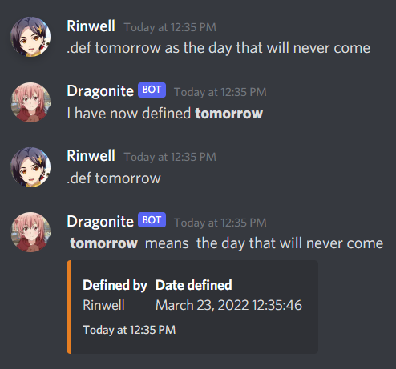

- UrbanDictionary

### Music
- Basic music commands such as join or leave a voice channel.
- Uses YouTube and plays the audio of a YouTube video in a voice channel.

### Miscellaneous
- A message module, allowing discord members to message other users within the server.
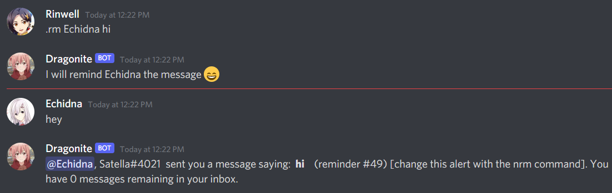
- A poll command

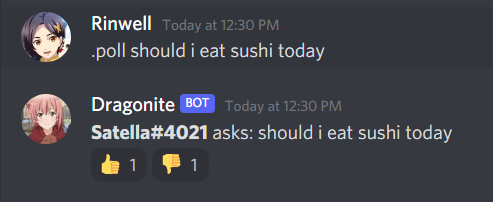
- View information about the server or a discord member. Shows join date, ID, Name, etc.

## License

MIT
